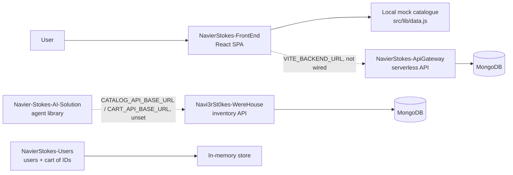
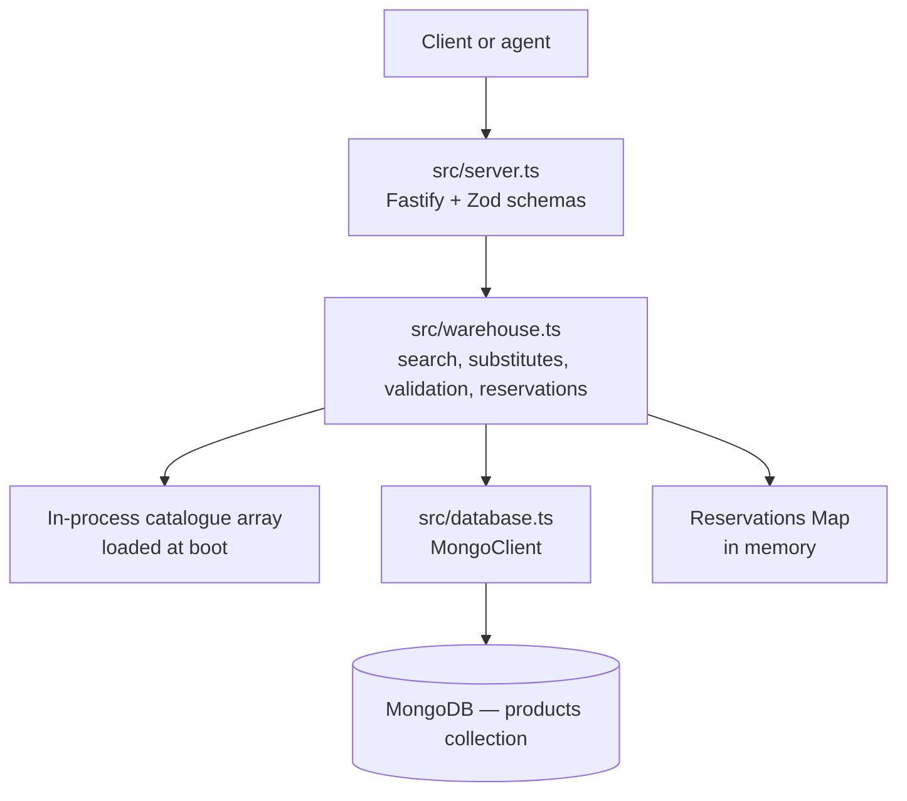

# Navi3rSt0kes — Warehouse

Inventory API for MarkECIA: product catalogue, search, substitutes, cart validation, and stock reservations, backed
by MongoDB.

## Overview

This repository owns **inventory truth**: what exists, what it costs, how much stock is left, and whether a proposed
cart can actually be fulfilled. It deliberately holds no user accounts, no checkout, and no conversation state.

Its search and validation endpoints are shaped for an agent caller: search returns scored candidates, every
out-of-stock line comes back with substitutes, and cart totals are computed server-side so a caller never has to
invent a price.

## System context

MarkECIA is split across five independent repositories:

| Repository | Responsibility |
| --- | --- |
| [`NavierStokes-FrontEnd`](https://github.com/Navi3rSt0kes/NavierStokes-FrontEnd) | React SPA — storefront, cart, and shopping-assistant UI |
| [`NavierStokes-ApiGateway`](https://github.com/Navi3rSt0kes/NavierStokes-ApiGateway) | MongoDB-backed HTTP API (auth, products, cart, orders, rule-based agent chat) plus a separate local in-memory service sandbox |
| [`Navi3rSt0kes-WereHouse`](https://github.com/Navi3rSt0kes/Navi3rSt0kes-WereHouse) | Inventory API — catalogue CRUD, search, substitutes, cart validation, stock reservations *(this repository)* |
| [`NavierStokes-Users`](https://github.com/Navi3rSt0kes/NavierStokes-Users) | Users API with a per-user cart that stores product IDs only |
| [`Navier-Stokes-AI-Solution`](https://github.com/Navi3rSt0kes/Navier-Stokes-AI-Solution) | `shopping-agent-core` — Python agent-orchestration library (planner + deterministic executor) |

> **Integration status.** No repository calls another in code today. In the diagram below, solid arrows are calls that
> exist in source; dashed arrows are integration points that exist only as configuration.



## Features

- **Catalogue CRUD** persisted in MongoDB, with a unique index on the product `id`.
- **Scored search** with accent- and punctuation-insensitive tokenization; matches weigh name ×3, tags ×2, category ×1.
- **Filters** by required tags, excluded tags, maximum price, category, and availability.
- **Substitutes** drawn from the same `grupo`, in stock, ranked by price proximity to the original.
- **Cart validation** that groups duplicate lines, computes subtotals and total, and returns a typed problem for every
  line that cannot be fulfilled (`agotado`, `stock_insuficiente`, `no_existe`) together with substitutes.
- **Reservations** that decrement stock atomically in MongoDB and can be confirmed or released.
- **Schema validation** on every request through Zod; failures return `400` with the validation message.
- **CORS allow-list** limited to `http://localhost:5173` and `http://localhost:3000`.

## Architecture



The catalogue is read from MongoDB once at start-up into an in-process array; reads are served from that array, while
writes go to both MongoDB and the array. `POST /admin/reset` reloads the array from MongoDB and clears reservations.

## Tech Stack

| Layer | Technology |
| --- | --- |
| Language | TypeScript (ES2022, NodeNext, `strict`) |
| Framework | Fastify 5 with `@fastify/cors` |
| Validation | Zod 3 |
| Database | MongoDB (`mongodb` driver) |
| Runtime/dev | `tsx` (watch and direct execution), `typescript` for type-checking |
| Container | Dockerfile on `node:20-alpine` |
| CI/CD | GitHub Actions — type-check, smoke script, Docker build; image published to GHCR |

## Project Structure

```text
Navi3rSt0kes-WereHouse/
├── src/
│   ├── server.ts        # Fastify app, routes, Zod schemas, error handler
│   ├── warehouse.ts     # catalogue, search, substitutes, validation, reservations
│   ├── database.ts      # .env loader, MongoClient, products collection
│   ├── types.ts         # Producto, ValidacionCarrito, ResultadoReserva, ...
│   └── smoke-test.ts    # placeholder (see Testing)
├── api/index.ts         # reduced Vercel handler (see Deployment)
├── data/products.json   # used only by api/index.ts — currently empty
├── cliente_agente.py    # standalone Python tool client (see Agent client)
├── Dockerfile
├── vercel.json
└── .github/workflows/   # ci.yml, cd.yml
```

## Prerequisites

- Node.js 20 or newer (the Docker image and both workflows use Node 20).
- A reachable MongoDB database. The process **exits at start-up** without a connection string.

## Installation

```bash
npm install
```

## Configuration

Copy `.env.example` to `.env`. `src/database.ts` parses that file directly at start-up (existing process variables win).

| Variable | Purpose | Required | Format |
| --- | --- | --- | --- |
| `MONGODB_URI` | MongoDB connection string | **Yes** — start-up throws `Falta MONGODB_URI` without it | standard MongoDB URI |
| `MONGODB_DB` | Database name | No — defaults to `warehouse` | database name |
| `CORS_ORIGINS` | Origin returned by the reduced Vercel handler in `api/index.ts` | No — defaults to an empty header | origin string |

`CORS_ORIGINS` is read **only** by `api/index.ts`. The Fastify server uses a hardcoded origin list.

## Running the Project

```bash
npm run dev        # tsx watch src/server.ts
npm start          # tsx src/server.ts
npm run typecheck  # tsc --noEmit
```

The server listens on **port 8000**, host `0.0.0.0`. The port is hardcoded in `src/server.ts` and is not configurable
through an environment variable.

With Docker:

```bash
docker build -t navi3rst0kes-warehouse .
docker run --rm -p 8000:8000 -e MONGODB_URI="<uri>" -e MONGODB_DB=warehouse navi3rst0kes-warehouse
```

## Data model

```ts
interface Producto {
  id: string; nombre: string; categoria: string; presentacion: string;
  unidad: string; contenido: number; precioCop: number; stock: number;
  grupo: string; emoji: string; tags: string[];
}
```

`grupo` is what makes two products interchangeable — substitutes are selected inside a `grupo`. `precioCop`,
`stock`, and `contenido` are non-negative; `precioCop` and `stock` are integers.

## API

Base URL in local development: `http://localhost:8000`.

### Health

`GET /health` → `200 { "estado": "ok" }`

### Catalogue

| Method | Route | Purpose |
| --- | --- | --- |
| `GET` | `/productos?categoria=` | Full catalogue, optionally filtered by category |
| `GET` | `/productos/:id` | One product — `404 { "error": "Producto no encontrado" }` when unknown |
| `GET` | `/categorias` | `[{ "categoria": "...", "conteo": 0 }]`, alphabetically sorted |
| `POST` | `/productos` | Create. `201` with the product, or `409 { "error": "Ya existe un producto con ese id" }` |
| `PUT` | `/productos/:id` | Replace. The body `id` must equal the path `id`, otherwise `404` |
| `DELETE` | `/productos/:id` | Delete. `404` when unknown **or when the product belongs to an active reservation** |

`POST` and `PUT` require the complete `Producto` body; any missing or mistyped field returns `400` with the Zod
message.

### Search

`GET /buscar`

| Parameter | Type | Required | Notes |
| --- | --- | --- | --- |
| `q` | string | **Yes** | Free-text query; `400` when absent or empty |
| `tagsRequeridos` | string | No | Comma-separated; every tag must be present |
| `tagsExcluidos` | string | No | Comma-separated; none may be present |
| `precioMax` | integer | No | Inclusive upper bound on `precioCop` |
| `categoria` | string | No | Exact category match |
| `soloDisponibles` | boolean | No | Keeps only products with `stock > 0` |
| `topK` | integer | No | Result cap, max 50, default 5 |

```bash
curl "http://localhost:8000/buscar?q=pollo&precioMax=20000&soloDisponibles=true"
```

```json
{
  "resultados": [
    { "id": "...", "nombre": "...", "categoria": "...", "presentacion": "...", "unidad": "...",
      "contenido": 0, "precioCop": 0, "stock": 0, "grupo": "...", "emoji": "...", "tags": ["..."],
      "disponible": true, "score": 5 }
  ],
  "totalEncontrados": 1
}
```

`totalEncontrados` counts every match with a positive score; `resultados` is the `topK` slice, sorted by score
descending and then by ascending price. Products scoring zero are excluded.

### Substitutes

`GET /productos/:id/sustitutos?topK=3` → an array of `Producto`.

Returns an empty array when the product is unknown or has no `grupo`. Candidates share the `grupo`, have stock, and
are ranked by absolute price distance from the original, then by price.

### Cart

`POST /carrito/validar`

```json
{ "items": [{ "id": "<product id>", "cantidad": 2 }] }
```

```json
{
  "disponibles": [
    { "id": "...", "nombre": "...", "emoji": "...", "presentacion": "...",
      "precioCop": 14900, "cantidad": 2, "subtotalCop": 29800 }
  ],
  "problemas": [
    { "id": "...", "nombre": "...", "motivo": "stock_insuficiente",
      "stockDisponible": 1, "cantidadPedida": 3, "sustitutos": [] }
  ],
  "totalCop": 29800,
  "todoDisponible": false
}
```

`motivo` is one of `agotado`, `stock_insuficiente`, or `no_existe`. Duplicate lines for the same `id` are summed
before validation. Validation never changes stock.

`POST /carrito/reservar` takes the same body. When everything is available it decrements stock in MongoDB and returns
the validation payload plus `"reservaId": "r0001"` and `"reservada": true`. Otherwise nothing is reserved and it
returns the validation payload with `"reservada": false`.

| Method | Route | Purpose | Response |
| --- | --- | --- | --- |
| `POST` | `/reservas/:id/confirmar` | Close a reservation, keeping the stock decrement | `{ "reservaId": "...", "confirmada": true }` or `404` |
| `POST` | `/reservas/:id/liberar` | Cancel a reservation and return the stock | `{ "reservaId": "...", "liberada": true }` or `404` |

Reservation IDs are sequential (`r0001`, `r0002`, …) and are held **in memory**: restarting the process loses the
reservation index while the stock decrement stays in MongoDB.

### Administration

`POST /admin/reset` → `{ "productos": 0, "mensaje": "Catálogo recargado desde MongoDB" }`

Reloads the in-process catalogue from MongoDB, clears all reservations, and resets the reservation counter. It does
not restore stock decremented by reservations.

### Status codes

| Code | Meaning |
| --- | --- |
| `200` | Success |
| `201` | Product created |
| `400` | Zod validation failure — `{ "error": "<validation message>" }` |
| `404` | Unknown product or reservation |
| `409` | Product `id` already exists |
| `500` | Unexpected error — `{ "error": "Error interno del servidor" }` |

## Agent client

`cliente_agente.py` is a self-contained Python client that exposes three of these endpoints as OpenAI-style
function-calling tools:

| Tool | Endpoint | Purpose |
| --- | --- | --- |
| `buscar_productos` | `GET /buscar` | Resolve a need into real IDs, prices, and stock |
| `sustitutos` | `GET /productos/:id/sustitutos` | Offer alternatives for an unavailable product |
| `validar_carrito` | `POST /carrito/validar` | Confirm availability and the authoritative total before showing a cart |

The tool descriptions instruct a model never to invent IDs or prices and to validate a cart before presenting it.
The base URL comes from `WAREHOUSE_URL` (default `http://localhost:8000`); failures degrade to
`{"error": "inventario no disponible"}` with a 5-second timeout.

> This script imports `requests`, which no dependency manifest in the repository declares. Install it yourself
> (`pip install requests`) before running the file directly.

## Testing

There is no automated test suite. `npm run smoke` exists but is a **placeholder**: it prints a notice that the remote
smoke test is disabled because it would mutate MongoDB Atlas data, and asserts nothing. The CI workflow runs it
anyway, so a green CI run proves the type-check and the Docker build, not runtime behaviour.

## Deployment

Two different deployment paths exist in this repository, and they do not expose the same API:

- **Container** (`Dockerfile`, `cd.yml`) — runs `npm start`, i.e. the full Fastify server on port 8000. The CD
  workflow publishes `ghcr.io/navi3rst0kes/navi3rst0kes-warehouse` on pushes to `main` and on `v*` tags.
- **Vercel** (`vercel.json`, `api/index.ts`) — rewrites every path to a **reduced handler** that reads
  `data/products.json` from disk instead of MongoDB and implements only `/health`, `/productos`, and `/buscar`. It
  has no CRUD, no substitutes, no cart, and no reservations.

CI (`ci.yml`) runs on pull requests to `develop`/`main` and pushes to `develop`: `npm ci`, `npm run typecheck`,
`npm run smoke`, and a Docker build.

## Integration

- **Consumed by:** nothing in code yet. The intended consumer is an agent caller — `cliente_agente.py` shows the
  shape of that integration.
- **Consumes:** MongoDB only.
- The CORS allow-list (`http://localhost:5173`, `http://localhost:3000`) matches the Vite dev server used by
  `NavierStokes-FrontEnd` and a second local origin.
- `Navier-Stokes-AI-Solution` can call an external catalogue over HTTP, but the routes it expects
  (`POST /products/search`, `GET /carts/{cart_id}`, `POST /carts/{cart_id}/items`) do not match the routes above, so
  connecting the two would require an adapter on the agent side.

## Troubleshooting

| Symptom | Cause | Action |
| --- | --- | --- |
| Start-up fails with `Falta MONGODB_URI` | No connection string in the environment or in `.env` | Add `MONGODB_URI` to `.env` |
| The catalogue is empty on every route | The `products` collection is empty, or `MONGODB_DB` points at the wrong database | Seed the collection, then call `POST /admin/reset` |
| A catalogue change is not visible | The in-process array is stale (for example after an external write) | Call `POST /admin/reset` or restart the process |
| `DELETE /productos/:id` returns `404` for a product that exists | The product is part of an active reservation | Release the reservation first with `POST /reservas/:id/liberar` |
| Browser requests blocked by CORS | The origin is not `http://localhost:5173` or `http://localhost:3000` | The list is hardcoded in `src/server.ts` |

## Known issues

- `api/index.ts` returns a hardcoded `"totalEncontrados": 0` on `/buscar`, regardless of how many results it found.
- `data/products.json` is an empty array, so the Vercel handler currently serves an empty catalogue.
- `npm run smoke` asserts nothing, and there is no other automated test coverage.
- Reservations are in-memory only, so a restart leaves stock decremented with no reservation left to release.
